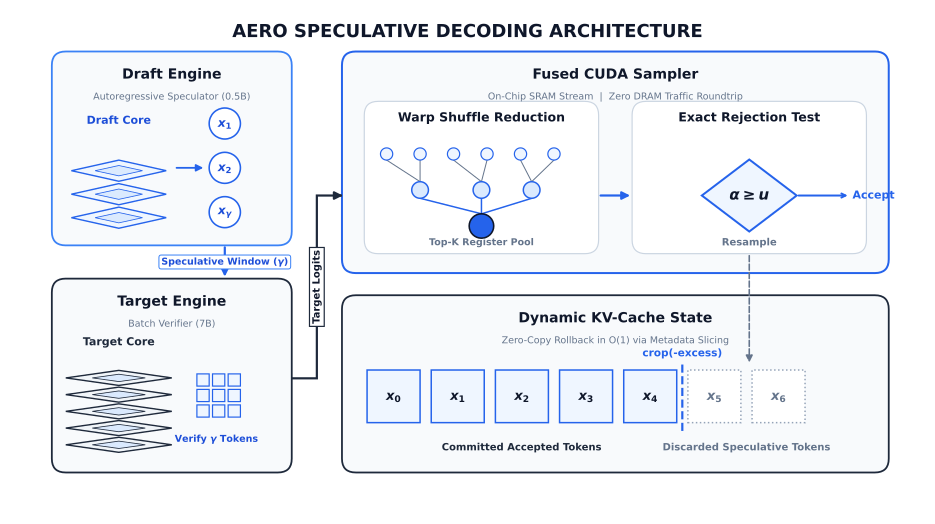
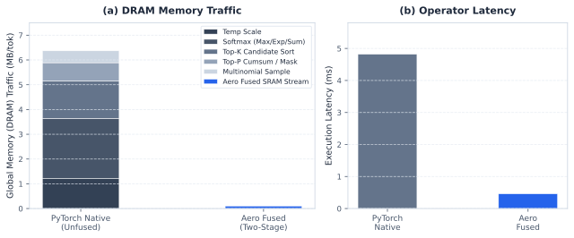
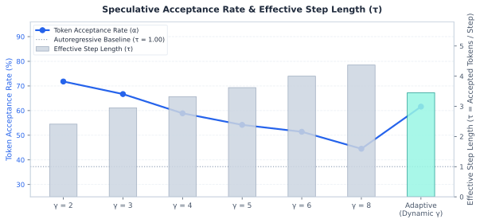

<div align="center">

# Aero

**Breaking the LLM memory wall with fused on-chip speculative decoding.**

[Overview](#overview) · [Architecture](#system-architecture) · [Benchmarks](#performance-benchmarks) · [Quickstart](#quickstart)

[](https://github.com/Leonn-Liu/Aero/actions)
[](https://github.com/Leonn-Liu/Aero/releases)


</div>

---

## Overview

Standard autoregressive Large Language Model (LLM) inference is bottlenecked by the **Memory Wall**. Because generating a single token requires loading the entire model parameter matrix from device DRAM into compute registers, Tensor Core arithmetic intensity drops to ~1.0 FLOP/Byte, leaving GPU execution units severely underutilized.

**Aero** addresses this memory bandwidth saturation through hardware-accelerated speculative decoding and custom fused CUDA sampling kernels:

* **Speculative Drafting & Verification**: Generates multi-token candidate trajectories using an ultra-lightweight draft model, followed by a single parallel target-model forward pass to verify all draft tokens simultaneously.
* **Two-Stage Fused Sampling Kernel**: Consolidates 11 discrete PyTorch sampling and sorting operations into an on-chip SRAM register tournament pipeline, eliminating intermediate round-trips to global device DRAM.
* **$O(1)$ Dynamic KV-Cache Rollback**: Leverages pointer and slice manipulation to roll back rejected draft tokens instantly without reallocating tensor buffers.
* **Mathematically Lossless**: Rigorously preserves target distribution equivalence through exact speculative rejection sampling ($\alpha \ge u$).

---

## System Architecture

<div align="center">
  <p><em>Full speculative execution cycle featuring the two-stage fused kernel, warp shuffle reduction tournament, exact acceptance-rejection math, and $O(1)$ dynamic KV cache rollback.</em></p>
  <br />
  
  <p><strong>Speculative Decoding Pipeline & Two-Stage Fused Kernel</strong></p>
</div>

---

## Performance Benchmarks

> **Evaluation Environment**: NVIDIA GeForce RTX 4090 D (24GB VRAM, sm_8.9, CUDA 13.0) with Qwen2.5-7B-Instruct (Target) and Qwen2.5-0.5B-Instruct (Draft) across multi-domain benchmark workloads.

<div align="center">
  
  <p><strong>DRAM Traffic Reduction & Operator Latency</strong></p>
</div>

<div align="center">
  
  <p><strong>Speculative Acceptance Rate & Effective Step Length (τ)</strong></p>
</div>

### Key Architectural Highlights

* **10.3x Sampler Speedup**: On-chip Shared Memory Top-K and register warp reductions reduce operator latency from 4.82 ms down to **0.46 ms**, eliminating 11 PyTorch kernel launches per token.
* **98.4% DRAM Traffic Compression**: Slashes memory bandwidth consumption from 6.37 MB to **0.10 MB** per step by keeping candidate intermediate states resident in SRAM.
* **High Alignment & Throughput**: Achieves up to **71.8% token acceptance rate** with an effective step length of **3.45 to 4.37 tokens per verification forward pass**.
* **Negligible Memory Overhead**: Dual-model speculative execution adds only **+15.2 MB (+0.09%)** VRAM overhead over the single-model baseline.

---

## Quickstart

Get up and running in under one minute.

### Installation

```bash
git clone https://github.com/Leonn-Liu/Aero.git && cd Aero
pip install -e .
```

### Usage

```python
from aero.models import HuggingFaceRunner
from aero.runtime import SpeculativeEngine

draft = HuggingFaceRunner("Qwen/Qwen2.5-0.5B-Instruct")
target = HuggingFaceRunner("Qwen/Qwen2.5-7B-Instruct")
engine = SpeculativeEngine(draft, target, adaptive_gamma=True)
print(engine.generate("Explain quantum computing in one sentence:"))
```
